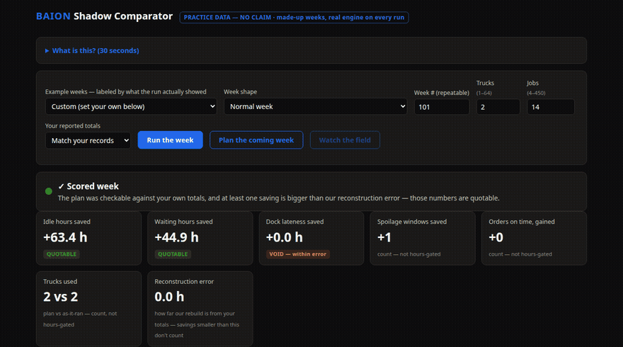

# BAION Systems LLC

**Coordination without choreography.** BAION researches a physical coordination substrate for AI agent teams: instead of a central orchestrator routing messages, agents couple through a shared dynamical medium. We are testing whether that coupling can support behaviors such as consensus, task allocation, and recovery from disruption — experimental program, receipts required, claims bounded by what runs prove.

A service-disabled-veteran-owned small business in Raleigh, North Carolina. Solo-founded, local-first, receipts-driven: every experimental claim in our work is backed by hash-chained run records on hardware we own.

## What's public here

- [`baion-std`](../baion-std) — seven languages (C, C++, Rust, Go, D, Haskell, OCaml) producing byte-identical canonical JSON + SHA-256, with a one-command cross-lineage verifier. The trust discipline underneath our multi-component systems.
- [`framework`](../framework) — essays on multi-model consensus, accountability, and why convergence is the product.
- **Live demo:** [demo.baion.dev](https://demo.baion.dev)

## See it run

The Shadow Comparator replays a work week on the real engine — every flash in the field view is an event read off the engine's grid, not drawn from the schedule. Practice data, clearly badged; it demonstrates the instrument, not a validated result:

*(Practice data, no claims — the badge in the UI means what it says. [Full walkthrough recording](media/baion_shadow_comparator_demo.mp4), or drive it yourself at [demo.baion.dev](https://demo.baion.dev).)*

## What's not (yet)

The coordination substrate itself (U.S. Provisional Patent Application #64/042,046) and related components are unreleased pending counsel review. BAION's long-run model is open: the business charges for responsibility, not control.

## Contact

Steven A. Mullins Jr., Founder / Managing Member — email preferred.
